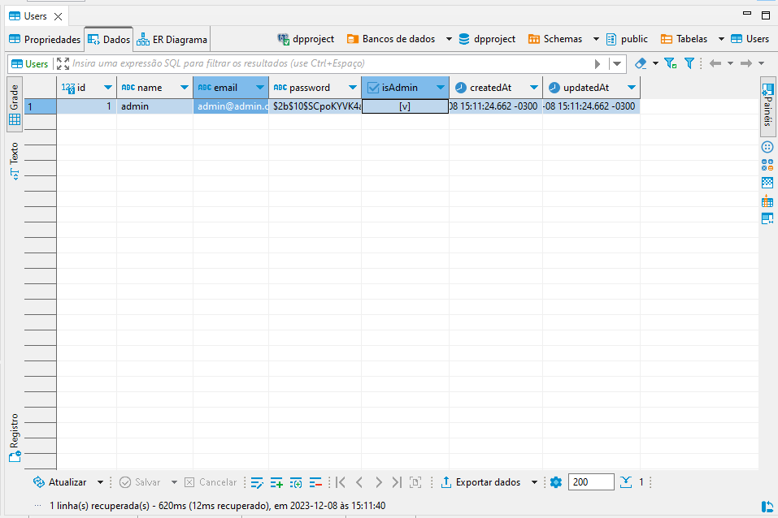
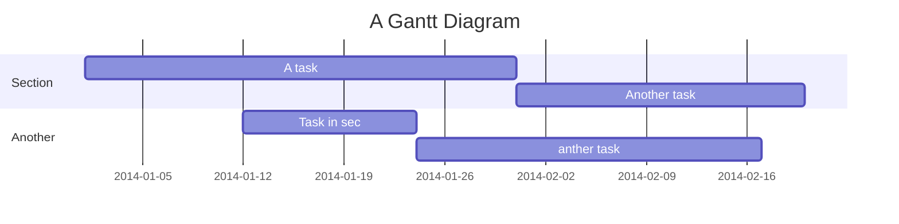

Projetos API Filmes
===


## Table of Contents

[TOC]

## Beginners Guide

Inicialização do projeto

1. Download ou faça um fork do projeto!
2. Instale Node v18.15.0 
3. Npm install 
4. Install database PostgreSQL , Port: 5432 , Version: 16.1
5. Create database with dpproject name.
6. create a .env file as shown below
6. NPM start para iniciar na porta 5000


## Arquivo .env


```gherkin=
# DATABASE

DB_HOST=localhost
DB_USER=postgres
DB_PASSWORD=123456
DB_NAME=dpproject
DB_PORT=5432

# FIRST ADMIN USER 
FIRST_NAME=admin
FIRST_EMAIL=admin@admin.com
FIRST_PASSWORD=123456
```



# Mensagem no console depois de criado o banco e primeiro usuario admin
```gherkin=
[nodemon] restarting due to changes...
[nodemon] starting `node ./index.js localhost 5000`
Executing (default): SELECT table_name FROM information_schema.tables WHERE table_schema = 'public' AND table_name = 'Users'Executing (default): SELECT i.relname AS name, ix.indisprimary AS primary, ix.indisunique AS unique, ix.indkey AS indkey, array_agg(a.attnum) as column_indexes, array_agg(a.attname) AS column_names, pg_get_indexdef(ix.indexrelid) AS definition FROM pg_class t, pg_class i, pg_index ix, pg_attribute a WHERE t.oid = ix.indrelid AND i.oid = ix.indexrelid AND a.attrelid = t.oid AND t.relkind = 'r' and t.relname = 'Users' GROUP BY i.relname, ix.indexrelid, ix.indisprimary, ix.indisunique, ix.indkey ORDER BY i.relname;
Executing (default): SELECT "id", "name", "email", "password", "isAdmin", "createdAt", "updatedAt" FROM "Users" AS "User" WHERE "User"."isAdmin" = true LIMIT 1;
O administrador já existe
O servidor está rodando na porta 5000
```

User story
---

```gherkin=
Feature: Guess the word

  # The first example has two steps
  Scenario: Maker starts a game
    When the Maker starts a game
    Then the Maker waits for a Breaker to join

  # The second example has three steps
  Scenario: Breaker joins a game
    Given the Maker has started a game with the word "silky"
    When the Breaker joins the Maker's game
    Then the Breaker must guess a word with 5 characters
```
> I choose a lazy person to do a hard job. Because a lazy person will find an easy way to do it. [name=Bill Gates]


```gherkin=
Feature: Shopping Cart
  As a Shopper
  I want to put items in my shopping cart
  Because I want to manage items before I check out

  Scenario: User adds item to cart
    Given I'm a logged-in User
    When I go to the Item page
    And I click "Add item to cart"
    Then the quantity of items in my cart should go up
    And my subtotal should increment
    And the warehouse inventory should decrement
```

> Read more about Gherkin here: https://docs.cucumber.io/gherkin/reference/

User flows
---
```sequence
Alice->Bob: Hello Bob, how are you?
Note right of Bob: Bob thinks
Bob-->Alice: I am good thanks!
Note left of Alice: Alice responds
Alice->Bob: Where have you been?
```

> Read more about sequence-diagrams here: http://bramp.github.io/js-sequence-diagrams/

Project Timeline
---


> Read more about mermaid here: http://mermaid-js.github.io/mermaid/

## Appendix and FAQ

:::info
**Find this document incomplete?** Leave a comment!
:::

###### tags: `Templates` `Documentation`

